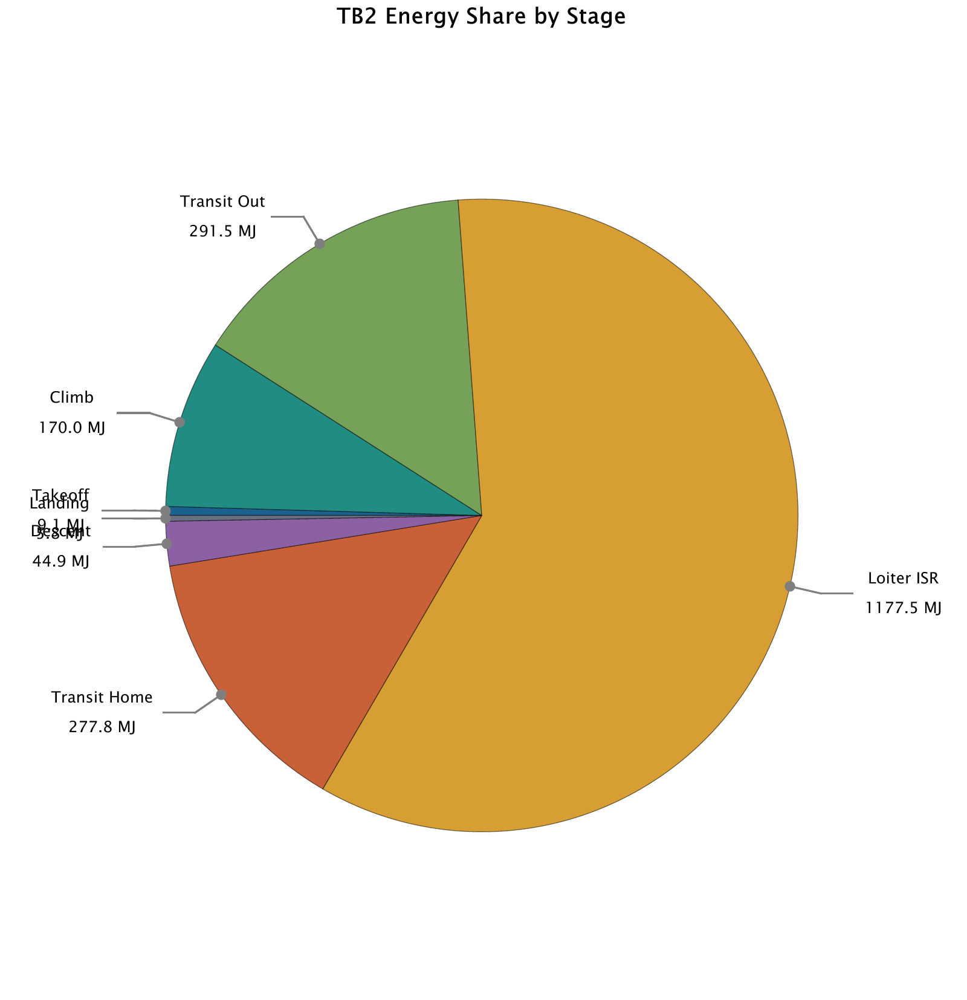
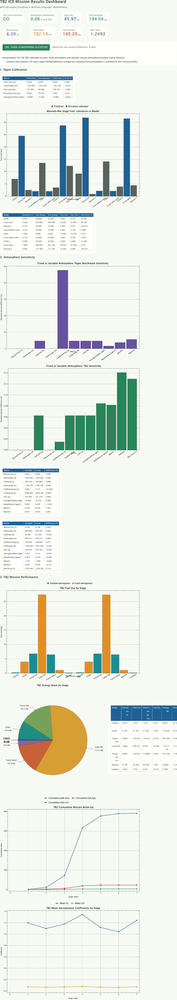

# Propulsion Comparison for the Bayraktar TB2 MALE UAV (Capstone Thesis)

*Team of 3 · FENG 498 Engineering Capstone · Izmir University of Economics · Spring 2026*

## Engineering question
How do a conventional internal combustion engine (ICE), a parallel hybrid-electric system and an electrically assisted (EM) drive compare in energy use and tailpipe CO₂ on the same TB2-class ISR mission? And can the ICE baseline be made credible by calibrating it against published flight data?

This repository contains **my part of the thesis: the ICE propulsion mission model (MATLAB)**. My second part, the weather decision application, has its own repository: **[uav-mission-weather-gate](https://github.com/Kiwiiiieee/uav-mission-weather-gate)**. The full thesis, including the hybrid and EM models by my teammates, is in `report/`.

## Approach (ICE model)
- **Reduced-order, point-mass segmented mission simulation** (forward Euler, Δt = 1 s), following the flight-performance method of Masood and Wei (2012). It uses:
  - the International Standard Atmosphere
  - a parabolic drag polar CD = CD0 + kCL²
  - V-speeds from the stall speed
  - the thrust balance along the flight path
  - fuel flow from BSFC and mass depletion
  - fuel energy from the lower heating value (LHV)
  - CO₂ = 3.16 × fuel burned
- **Calibration:** the nine-segment Masood-Wei benchmark (540 kg UAV, Rotax 914UL, 100 hp) is rebuilt and simulated. The BSFC is then scaled so that the simulated fuel matches the published 101 kg, giving kBSFC = 101.0 / 80.848 = **1.2493**.
- **Transfer to the TB2 class** (MTOW 700 kg, 240 kg fuel, 12 m span, 100 hp) on a 7-stage ISR mission: Takeoff → Climb → Transit Out → Loiter ISR 4 h → Transit Home → Descent → Landing.
- **Speed optimisation:** the transit speed minimises fuel per km (best range) and the loiter speed minimises fuel per hour (best endurance), both at 70 % fuel and 3,000 m.
- **Atmosphere sensitivity study:** variable vs fixed atmosphere, a one-factor comparison with a 2 % acceptance threshold.

## Results (ICE model)
- **Calibration:** the fuel-consumption error fell from about −20 % (uncalibrated, 80.85 kg) to **−0.83 %** (calibrated, 100.16 kg vs 101 kg published).
- **TB2 ISR mission:**
  - **45.97 kg** fuel, **782.59 km** path in **6.20 h**
  - **1,976.5 MJ** of fuel energy
  - **145.25 kg** of tailpipe CO₂
- **Loiter ISR dominates the energy use:** 1,177.5 MJ, **59.6 %** of the mission total, which makes the endurance phase the main target for propulsion improvements.
- **Atmosphere sensitivity:** a fixed atmosphere changes the TB2 outputs by at most about 0.06 % (fuel −0.063 %), so the simplification is justified for the propulsion comparison. For the higher-altitude paper mission, it would introduce a +4.70 % fuel error.

| Stage | Duration (h) | Path (km) | Fuel (kg) | Energy (MJ) |
|---|---|---|---|---|
| Takeoff | 0.013 | 1.43 | 0.211 | 9.05 |
| Climb | 0.167 | 21.18 | 3.954 | 170.0 |
| Transit Out | 0.900 | 120.01 | 6.779 | 291.5 |
| Loiter ISR | 4.000 | 600.24 | 31.56 | 1,177.5 |
| Transit Home | 0.900 | 120.01 | 6.461 | 277.8 |
| Descent | 0.194 | 17.12 | 1.041 | 44.9 |
| Landing | 0.025 | 2.58 | 0.131 | 5.8 |
| **Total** | **6.198** | **782.59** | **45.97** | **1,976.5** |

**Team-level outcome (from the thesis).** The parallel hybrid-electric model was recommended for the TB2 class. It cuts fuel and CO₂ by 39.58 % (27.77 kg fuel) compared with the calibrated ICE baseline, and improves mission energy efficiency by 47.5 % (0.59 km/MJ). The EM-assisted configuration stayed close to the baseline (45.90 kg fuel, 145.00 kg CO₂) because its electrical assist was depleted early in the loiter phase.

## Validation
- The ICE model is calibrated against the published Masood and Wei (2012) benchmark. Mission time matches exactly, range is within −0.08 % and fuel within −0.83 % (Table 4 of the thesis).
- The calibrated BSFC (0.3998 kg/kWh) is checked against the Rotax 914 reference range.
- The report states these limitations: a parabolic drag polar (no proprietary TB2 polar), calibration against a comparable but non-identical UAV mission, and tailpipe-only CO₂ (no lifecycle emissions).

## Figures
Figures are from the thesis (figure numbers and captions as in the ICE results section).

*Figure 1: Masood-Wei benchmark mission: (a) velocity and stall-speed profiles; (b) 3D mission trajectory; (c) aircraft mass over time; (d) engine power fraction over time. Calibrated variable-atmosphere model.*

*Figure 2: TB2 speed optimisation: transit speed (minimum fuel per km, upper) and loiter speed (minimum fuel per hour, lower). Dashed lines indicate the selected optimal speeds.*

*Figure 3 (TB2 calibrated ISR mission profile: altitude schedule, upper, and velocity schedule with stall-speed and optimal-speed reference lines, lower) is the header image.*

*Figure 4: TB2 mission energy consumption: cumulative fuel energy (MJ) and fuel used (kg) over time (upper); stage-level fuel consumption bar chart (lower).*

*Figure 5: TB2 energy share by stage. Loiter ISR dominates at 1,177.5 MJ (59.6 % of total mission energy).*

*Figure 6: TB2 stage-normalised profiles: velocity, fuel flow rate, thrust and cumulative fuel used. Each stage occupies equal visual width.*

*Figure 7: TB2 calibrated mission, alternate normalised stage representation highlighting fuel accumulation across all seven flight phases.*

*Figure 8: Atmosphere sensitivity comparison: paper benchmark (large fixed-atmosphere error) vs. TB2 mission (negligible fixed-atmosphere error).*

*Figure 9: TB2 ICE mission summary dashboard. Atmosphere simplification accepted (0.06 % max diff); fuel used 45.97 kg; CO₂ 145.25 kg; BSFC scale 1.2493.*

The individual dashboard panels (`figures/00_…` to `13_…`) are also provided as PDF and PNG.

## Repository contents
| Path | Content | Opens with |
|---|---|---|
| `code/matlab/tb2_ice_masoodwei_calibrated_mission.m` | My ICE mission model: benchmark rebuild, BSFC calibration, atmosphere sensitivity, TB2 ISR mission, speed optimisation and all plots | MATLAB (R2024 used in the thesis) |
| `code/matlab/tb2_ice_masoodwei_calibrated_mission.txt` | Plain-text copy of the same model (same code apart from blank lines and indentation) | Any text editor |
| `report/FINAL-REPORT.pdf` | Full capstone thesis (56 pages, all three propulsion models) | Any PDF reader |
| `report/# MATLAB ICE Mission Model Referenc.txt` | Reference map linking each modelling choice in the ICE code to the literature | Any text editor (Markdown) |
| `presentation/FINAL-PRESENTATION.pdf` | Final presentation slides | Any PDF reader |
| `figures/MASOOD-WEI PAPER CALIBRATION SUMMAR.txt` | Calibration summary printed by the model | Any text editor |
| `figures/` | ICE model figures and dashboard panels (PDF originals plus PNG copies) | Image viewer, PDF reader |

## How to reproduce
Open MATLAB in `code/matlab/` and run `tb2_ice_masoodwei_calibrated_mission.m`. It prints the calibration and TB2 mission summaries to the Command Window and opens the benchmark, atmosphere-sensitivity, mission, energy, normalised-stage and speed-optimisation figures. All model inputs (aircraft data, mission segments, BSFC, LHV, CO₂ factor) are defined inside the script; Appendix A of the thesis lists the key parameters.

## Team and my contribution
Team of three, supervised by Prof. Diaa Gadelmavla (as written in the thesis):
- **Kaoutar Ammara:** ICE propulsion mission model (MATLAB) and the weather decision application ([uav-mission-weather-gate](https://github.com/Kiwiiiieee/uav-mission-weather-gate))
- **Hikmet Gökay Karakaya:** hybrid propulsion model
- **Elif Tosun:** electromagnetic (EM-assisted) model and comparison

Only my own code is included here. The hybrid and EM models are described in the thesis but their code is not part of this repository.

## References
Masood, K. and Wei, Z. (2012), "Detailed Flight Performance Analysis of a Fixed Wing UAV", AIAA 2012-2595. The full reference list is in the thesis.

---
Kaoutar Ammara · Aerospace Engineer · [GitHub](https://github.com/Kiwiiiieee) · [LinkedIn](https://linkedin.com/in/kaoutar-ammara)
